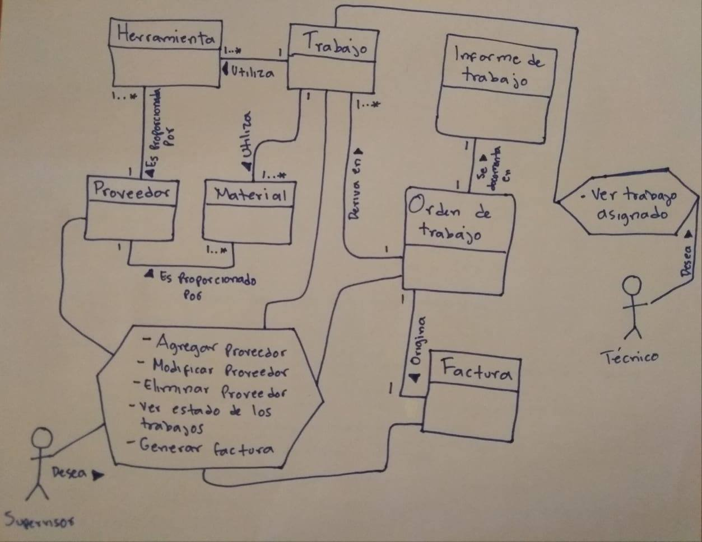
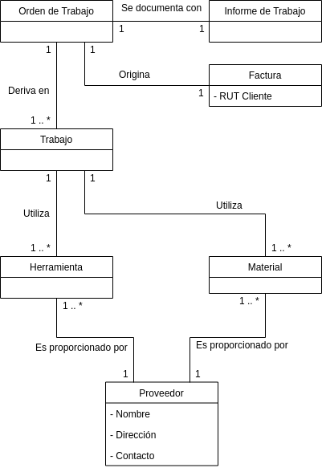

# Proyecto INF236-2021-1

A continuación, se indican los puntos a considerar dentro del desarrollo del proyecto correspondiente al primer semestre del año 2021 para la asignatura de Análisis y Diseño de Software (INF236) del [Departamento de Informáctica](https://www.inf.utfsm.cl/) de la [Universidad Técnica Federico Santa María](https://www.usm.cl/).

A continuación,  se indica un historial de los cambios relevantes en la presente documentación:

| Fecha | Descripción |
| --- | --- |
| 03/05/2021 | Primera versión.  Se genera estructura.|

**NOTA**:*el texto en cursiva debe ser reemplazado por el cotenido de su trabajo*.

## Integrantes

* [Wladimir Ormazábal (Paralelo 1) Rol: 2430005-6](mailto:wladimir.ormazabal@usm.cl)
* *reemplazar con los integrantes de su grupo*

## Contexto.

El contexto del proyecto fue presentado en el siguiente [video](https://youtu.be/ro2VyjbnnfQ).

*Puede complementar este punto si lo desea*

## Presentaciones

Las presentaciones realizadas en el contexto del proyecto son las siguientes:

* [Presentación 1 (02/05/2021)](https://youtu.be/ro2VyjbnnfQ)
* *reemplaza con el enlace a la primera presentación, y aqui va agregando las siguientes*

# Principales antecedentes

## Objetivos y Criterios de éxito

*Identificar claramente los objetivos y criterios de éxito del proyecto. Dicho de otra forma, justificar la razón por la que el proyecto es útil para el cliente y las razones por las que (cree que) podría declararse satisfecho o frustrado.*
*La tabla de objetivos y criterios de éxito debe ser planteada desde la perspectiva de lo que la implementación entregará al cliente y al usuario. Se recomienda establecer de 2 a 4 objetivos, que deben sumar un mínimo de 8 criterios de éxito.*

*Puede incluir un texto introductorio a la sección. Reemplace la siguiente tabla:*

| Objetivos | Criterios de éxito |
| --- | --- |
| **O1**: Informar oportunamente a los trabajadores las tareas que deben realizar. | **C1.1**: El personal de operaciones identifica las tareas que debe realizar  **C1.2**: El personal tiene una estimación de las tareas que tiene pendientes por hacer|
| **O2**: Identificar los materiales que los trabajadores usarán en sus tareas. | **C2.1**: El personal de operaciones relaciona los materiales que debe usar con las tareas que debe ejecutar  **C2.2**: El personal administrativo especifica los materiales que el personal operativo debe usar en sus tareas  **C2.3**: El personal administrativo tiene una estimación de los materiales que serán requeridos en tareas del personal operativo|
| **O3**: Otro objetivo. | **C1.1**: Otro criterio  **C1.2**: Otro criterio|

## Diagrama de Contexto

*Reemplace estos párrafos con una descripción de los aspectos generales que han sido considerados para el modelo de contexto de la figura 1*

## Modelo de Dominio

*Reemplace estos párrafos con una descripción de los aspectos generales que han sido considerados para el modelo de dominio y las consideraciones tomadas al momento de especificar las multiplicidades de las relaciones entre las clases del modelo*

## Hisorias de Usuario

*Indique un enlace a las Historias de Usuario, e indicando a la entrega a la que se asocia*

| HU | Entrega | Observaciones | 
| --- | --- | --- |
| [Mapa del merodeador](https://jira.toeska.cl/browse/INFTEST236-1)| H1 (02/05/2021) | Formo parte de la priera presentación.   Se consideran sus observaciones para la entrega H2. |